# Gokyo Bistro – UI/UX Case Study

A UI/UX design concept for a restaurant application that allows customers to browse the menu, place food orders, reserve tables, manage payments, and track their order history through a single mobile experience.

**Figma Design:**  
[View Design](https://www.figma.com/design/pUHKAgMnMZc0SSXusdP7ao/Gokyo-Bistro-UI-UX?t=YwGMb1bYPgavd7b0-1)

---

## Overview

Gokyo Bistro was designed as a complete digital experience for a restaurant that combines food ordering and table reservation into one application.

The goal of this project was to create a user journey that feels familiar, requires minimal effort, and keeps important actions accessible within a few taps.

The application focuses on:

- Online food ordering
- Table reservations
- Restaurant offers
- Digital payments
- Order tracking
- Reservation management

---

## Design Approach

The interface follows a clean and minimal visual style using warm neutral colors combined with green accents to reflect hospitality and freshness.

Throughout the project I focused on:

- Consistent spacing
- Large touch-friendly buttons
- Simple navigation
- Minimal cognitive load
- Clear information hierarchy

The entire experience was designed around a straightforward customer journey from registration to placing an order or booking a table.

---

# User Flow

```
Landing
   ↓
Registration
   ↓
Login
   ↓
Dashboard
   ├──────────────┐
   │              │
Menu         Table Booking
   │              │
Beverages     Booking Confirmation
   │
Order Summary
   │
Payment
   │
Bill
   │
Feedback
```

Admin users can access a separate dashboard for restaurant management.

---

# Screens

## 01 — Landing Page

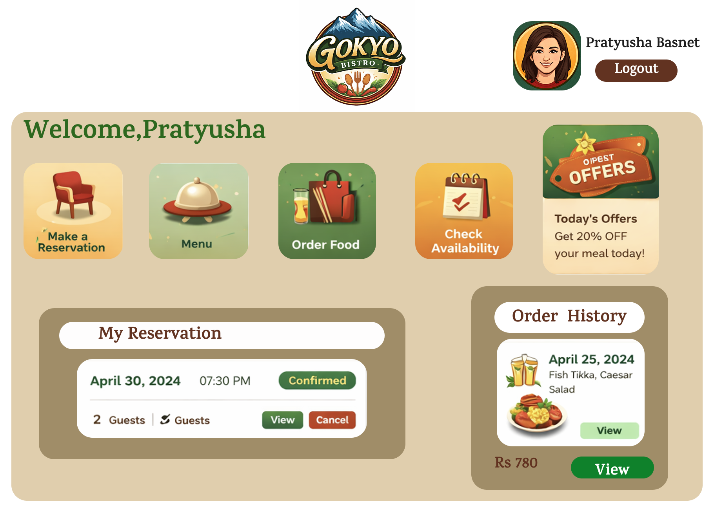

The landing page introduces the restaurant and provides users with quick access to registration and login.

---

## 02 — Registration

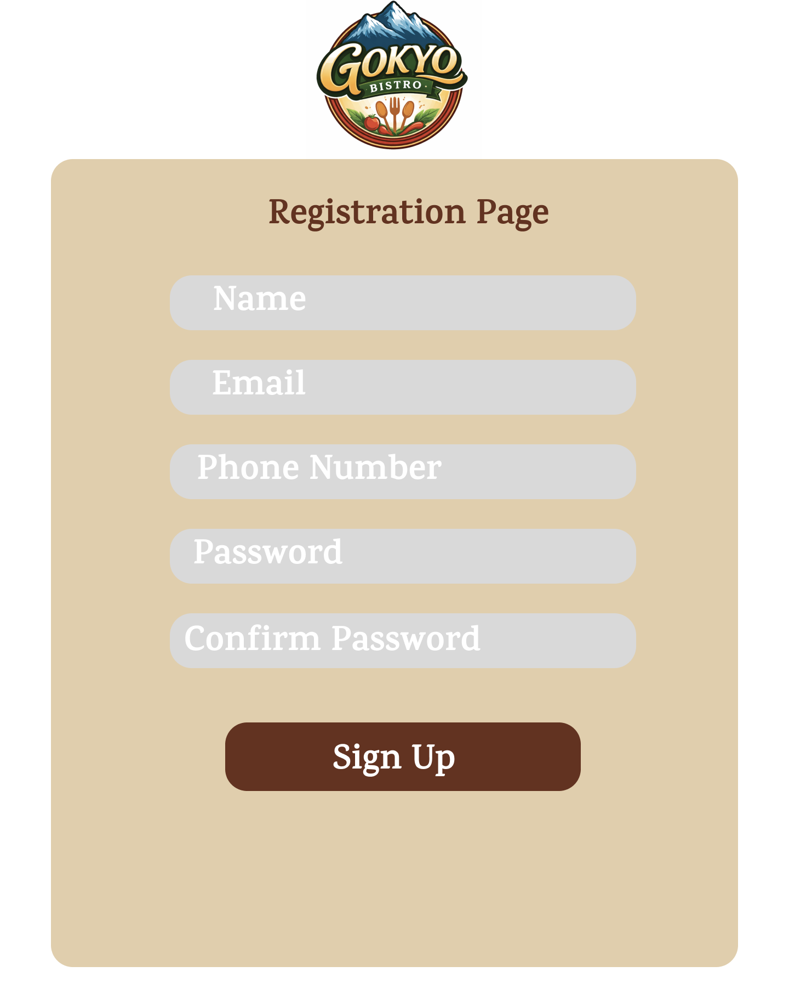

New users can create an account using a clean and simple registration form.

---

## 03 — Login

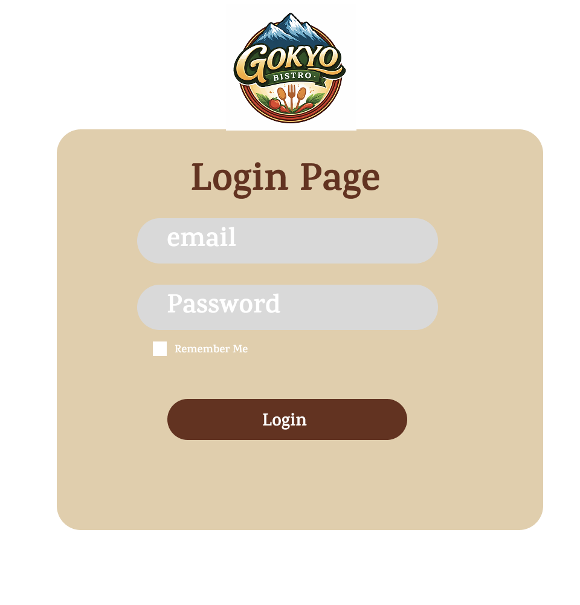

A straightforward authentication screen designed with minimal distractions.

---

## 04 — User Dashboard


The dashboard acts as the central hub where users can:

- Browse Menu
- Order Food
- Reserve Tables
- Check Availability
- View Offers
- Manage Reservations
- View Order History

---

## 05 — Menu

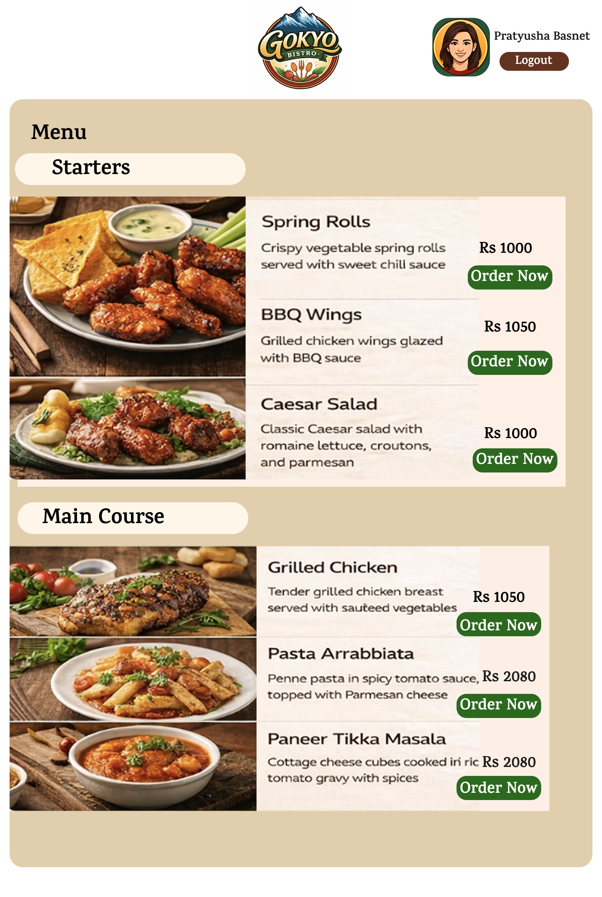

Food items are organized into categories with clear pricing, imagery, and ordering actions.

---

## 06 — Beverage Selection

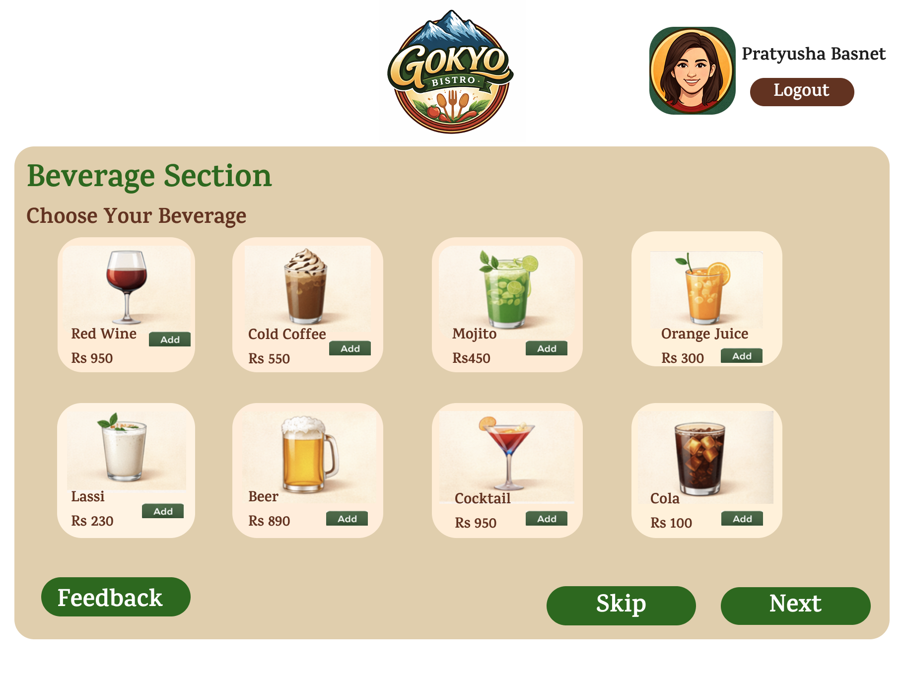

Dedicated beverage selection screen allowing users to quickly add drinks to their order.

---

## 07 — Order Summary

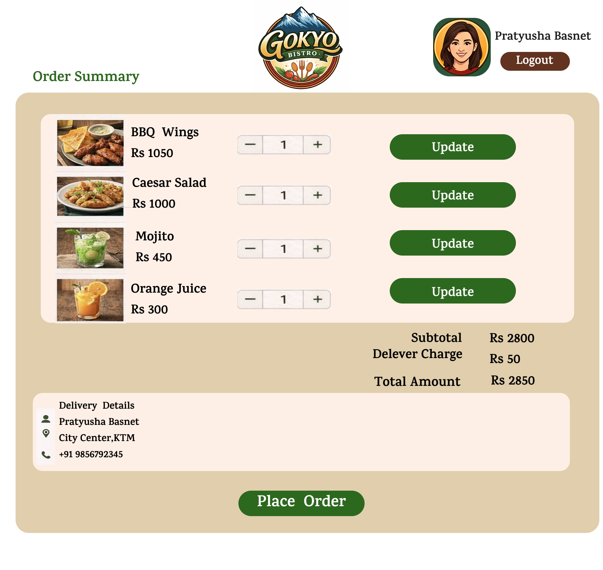

Before checkout users can:

- Update quantities
- Review pricing
- Verify delivery information
- View subtotal and total

---

## 08 — Table Booking

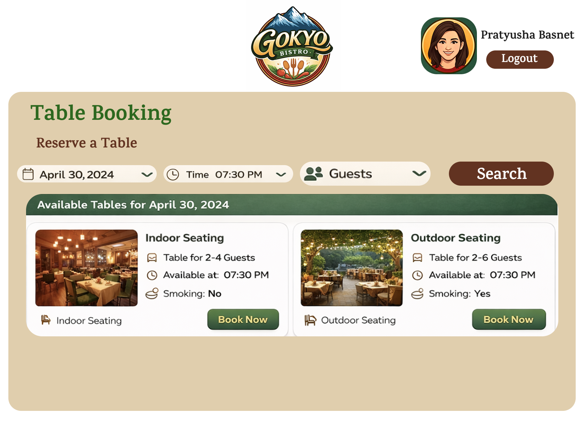

Customers can reserve tables by selecting:

- Date
- Time
- Number of guests

Available seating options are displayed with booking details.

---

## 09 — Booking Confirmation

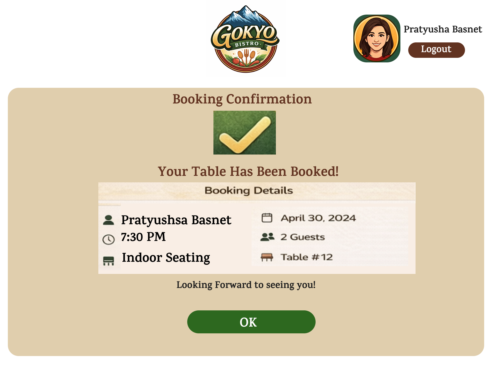

Displays reservation details after a successful table booking.

---

## 10 — Payment

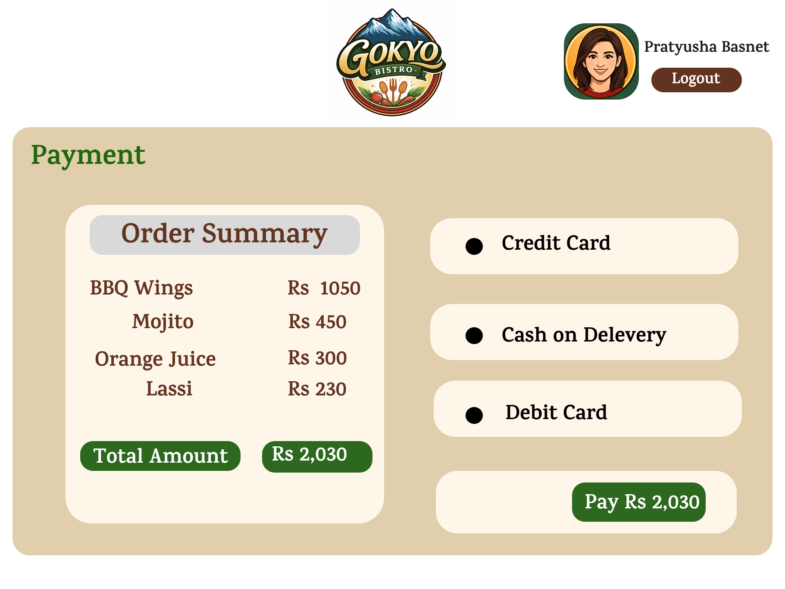

Users can review their order and choose between multiple payment methods before completing checkout.

---

## 11 — Bill

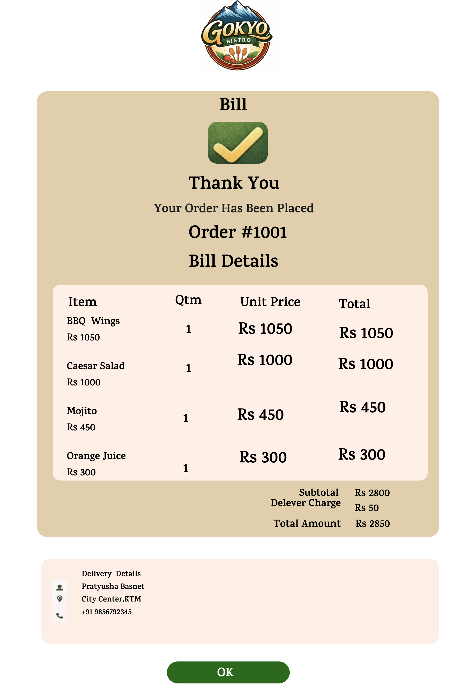

The final invoice displays:

- Ordered items
- Quantity
- Individual prices
- Total amount
- Delivery details

---

## 12 — Feedback

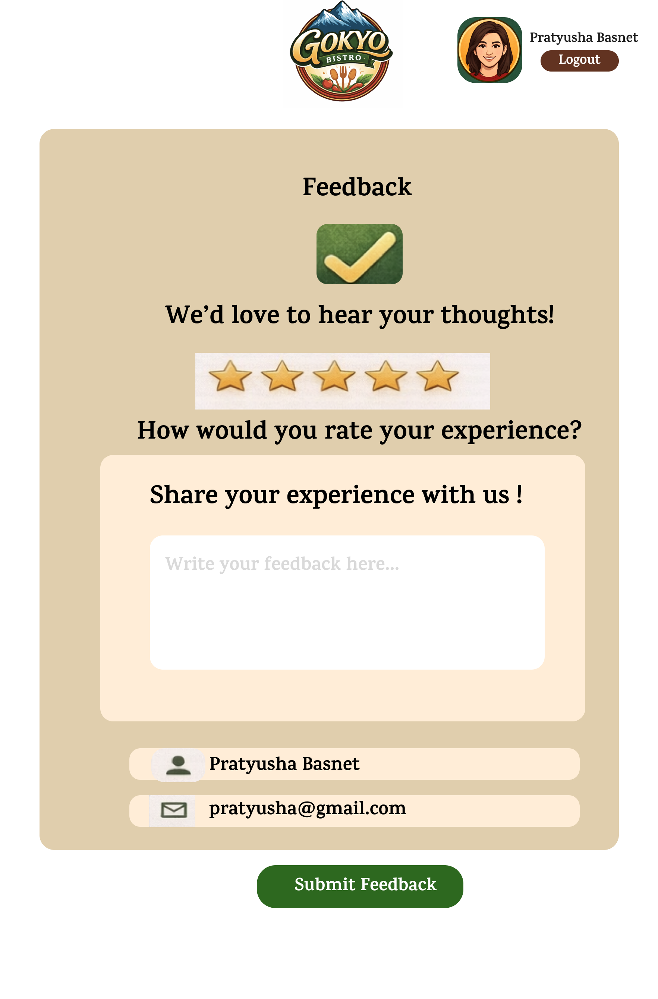

Users can submit feedback after completing their dining or ordering experience.

---

## 13 — Admin Dashboard

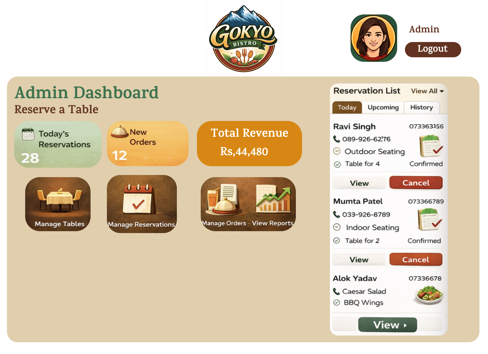

A separate dashboard designed for restaurant administrators to monitor reservations, orders, and overall restaurant operations.

---

# Complete Design

<p align="center">


</p>

<p align="center">


</p>

<p align="center">


</p>

---

# Tools Used

- Figma
- Auto Layout
- Components
- Variants
- Interactive Prototyping

---

# Future Improvements

If the project were extended further, I would explore:

- Live order tracking
- Online table availability
- Loyalty and rewards
- Push notifications
- Profile management
- Dark mode
- Restaurant analytics dashboard
- Multi-language support

---

# Designer

**Pratyusha Basnet**

This project was created as part of my UI/UX portfolio to explore the design of an end-to-end restaurant ordering and reservation experience.
